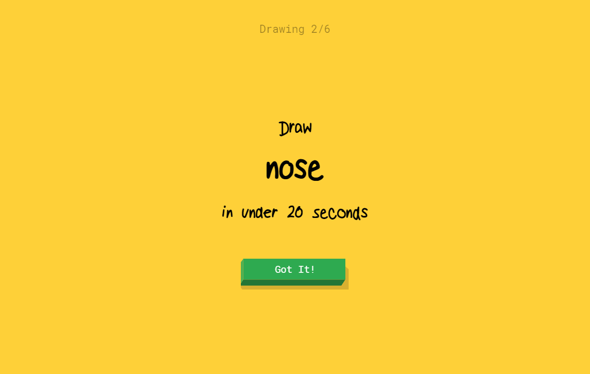
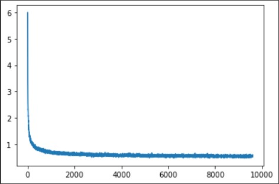

# Real-Time Doodle Classifier

We have created a Real-time doodle classifier using the concepts of Neural Networks with Deep Learning. Where we draw doodles in real time, and then our model classify them into one of the chosen classes among 20. Similar to Google's Quick draw.

# Dataset

The dataset used consisted of 2807037 doodle images of size 28x28 to be classified into 20 classes.  
Dataset link: https://drive.google.com/file/d/1HS05bmAim7YRod3edsoMyQtXG_k1agJJ/view?usp=sharing

# Approach

The **Prelimnary Stage** involved studying and learning the basics of Machine Learning and Deep Learning algorithms .

For better understanding of the topic, developed a **Digit Classifier** from scratch using the MNIST dataset coded using numpy. The writing of all the functions from scratch for the Forward and Backward propagation along with activations and calculating gradients and putting it all into an iterative learning function helped strengthen the concepts.

The **CNN model** is coded with the help of pytorch library for the convolution of image with filters along with maxpooling. After multiple convolutional layers, the input representation is flattened into a feature vector and passed through a network of neurons to predict the output probabilities.

A **Drawing Pad** is also created using OpenCv to facilitate the user in giving inputs in drawing the doodle for the developed model to classify it.

# CNN Architecture

Training a Convolutional Neural Network with 2 **Convolutional Layers**, both using a filter size of 5x5:

| Layer | Kernel size | No. of Filters |
| ----- | ----------- | -------------- |
| Conv1 | (3,3)       | 4              |
| Conv2 | (3,3)       | 8              |

**Fully Connected Layer**

| Layer | Size             |
| ----- | ---------------- |
| fcc 1 | (8 x 7 x 7, 150) |
| fcc 2 | (150, 50)        |

### Hyperparamters

| Parameters      | Value              |
| --------------- | ------------------ |
| Learning rate   | 0.001              |
| Mini batch size | 2048               |
| Epochs          | 10                 |
| Activation      | ReLU               |
| Loss            | Cross Entropy Loss |
| Optimizer       | Adams              |

# Results

Loss vs No. of Epochs graph  

### Accuracy

| Dataset   | Accuracy |
| --------- | -------- |
| Train set | 90.18%   |
| Test set  | 89.67%   |

# Final Outcome

# Resources referred

- [Coursera Deep Learning](https://www.coursera.org/specializations/deep-learning)
- [Pytorch documentation](https://pytorch.org/docs/stable/index.html)
